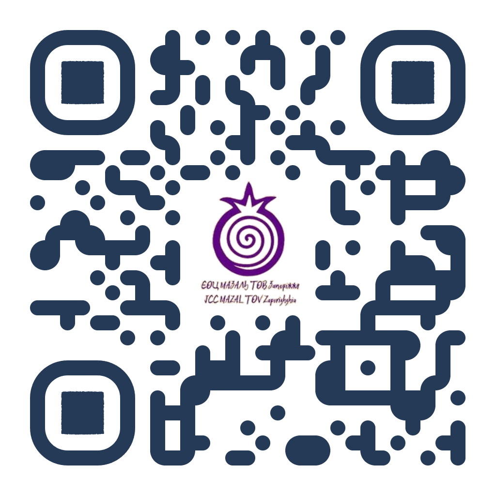

---
layout: default
theme: jekyll-theme-minimal
title: Chest of godness homepage
description: Bookmark this to keep an eye on my project updates
---!
<!DOCTYPE html>
<html lang="uk">
<head>
  <meta charset="UTF-8">
  <meta name="viewport" content="width=device-width, initial-scale=1.0">
  <meta property="og:title" content="Скриня добра">
  <meta property="og:description" content="Відкрий скарб добра, підтримай нас ще раз">
  <meta property="og:image" content="https://example.com/images/home.png">
  <meta property="og:url" content="https://example.com">
  <link href="https://fonts.googleapis.com/css2?family=Manrope:wght@600&family=Geologica:wght@700&display=swap" rel="stylesheet">
  
</head>
<body>

<!-- ПЕРЕКЛАДАЧ -->

<audio id="myAudio">
  <source src="./audio/hava-nagila-orchestra-clarinet-7671.mp3" type="audio/mpeg">
  Ваш браузер не підтримує аудіо.
</audio>

<section class="one">
  
Кожен акт добра — це промінь світла у нашому світі

  

    
    
  

  

  

    <button class="wave-button">ВІДКРИТИ СКАРБ ЦДАКИ</button>
  

</section>

<section class="two">
  

    Завдяки вашій цдаці ми створюємо безпеку, силу   громади та майбутнє для кожного
  

  
  

  

</section>

<section class="tree">
  

    Нехай ваша доброта повернеться до вас   сторицею — תִּזְכּוּ לְמִצְווֹת (тизку ле-міцвот).
  

  

    <a href="https://next.privat24.ua/payments/form/%7B%22token%22%3A%22be0ba580-a488-4ab6-b285-4fe127c71313%22%7D" target="_blank">
      <button class="help-button">ПІДТРИМАТИ ЩЕ РАЗ</button>
    </a>
  

  
  
</section>

</body>
</html>
